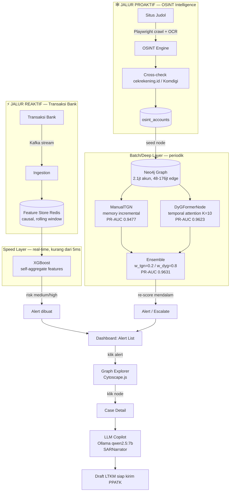

# MuleRadar

**Graph-Based Investigation Workbench untuk Deteksi Jaringan Rekening Penampung & Money Laundering di Ekosistem Keuangan Digital Indonesia**

Digdaya × Hackathon 2026 — Bank Indonesia (PIDI, 3rd Submission Proposal)

---

## Masalah

Money laundering modern beroperasi sebagai **jaringan rekening penampung (mule network)** yang tersebar — bukan satu rekening tunggal. Pelaku memecah dana jadi banyak transaksi kecil (structuring), melapis melalui rantai rekening (layering), lalu cash-out. Sistem AML konvensional memeriksa rekening **satu per satu** dengan threshold statis, sehingga pola jaringan ini lolos — terutama saat pelaku sengaja memakai rekening yang **baru dibuat** (tanpa riwayat transaksi yang bisa dicurigai secara individual).

OJK mencatat **Rp7,5 triliun** kerugian dari 530.794 rekening sejak IASC berjalan, dengan gap ~430.000 rekening yang dilaporkan tapi belum tertangani.

## Solusi

MuleRadar beroperasi dalam dua mode yang saling menyuburkan graph yang sama: **proaktif** (hunting rekening judol sebelum masuk sistem bank) dan **reaktif** (deteksi pola mencurigakan dari transaksi yang masuk).

### Alur sistem end-to-end



Deteksi **berlapis**:

1. **OSINT Intelligence** — crawl situs judol, ekstrak rekening bandar, deteksi jaringan via shared rekening, cross-check cekrekening.id (Komdigi)
2. **AML core rules** — structuring, fan-out, layering, cycle
3. **Statistical anomaly** — z-score/percentile adaptif (bukan threshold statis)
4. **Graph motif** — deteksi topologi cycle (A→B→C→A)
5. **ML ensemble** — XGBoost (tabular real-time) + ManualTGN (temporal memory) + DyGFormerNode (temporal graph transformer)
6. **7 typology pack Indonesia** — judol ring, QRIS fraud, dormant activation, PEP network, vendor cangkang, smurf layering, rapid in-out (sesuai Tipologi PPATK + kalibrasi BI)
7. **LLM Copilot** — auto-narasi SAR + draft LTKM bahasa Indonesia (Ollama on-premise, zero data egress)

**Diferensiasi vs GambitHunter:** GambitHunter menemukan rekening judol dan berhenti. MuleRadar meneruskan ke graph tracing jaringan money mule dan menghasilkan LTKM resmi untuk PPATK — pipeline investigasi penuh dari situs judol hingga laporan hukum.

## Hasil Model — Evaluasi Jujur (Temporal-Inductive Split)

### Metodologi

Semua angka di bawah dievaluasi dengan **temporal-inductive split** (70/15/15 berdasarkan `first_seen` tiap akun, bukan split acak) — akun di test set **genuinely belum pernah muncul** saat model dilatih, mensimulasikan skenario produksi nyata (mule account baru yang direkrut). Fitur graph-struktural (device sharing, institution diversity, PageRank, k-core) dihitung dengan **causal cutoff** — hanya dari edge sebelum batas waktu val/test, mencegah kebocoran struktur graph masa depan.

| Model                            | PR-AUC (test, temporal) | Catatan                                                                                  |
| -------------------------------- | ----------------------- | ---------------------------------------------------------------------------------------- |
| **ManualTGN**              | **0.9477**        | Memory incremental per-node, causal-fixed                                                |
| **DyGFormerNode**          | **0.9623**        | Attention K=10 tetangga temporal, causal-fixed,**diverifikasi 3 sudut independen** |
| **Ensemble TGN+DyGFormer** | **0.9631**        | w_tgn=0.2 / w_dyg=0.8, verified di test set yang sama persis                             |
| XGBoost (standalone)             | 0.4589                  | Data Postgres partial 79.5%, split temporal-inductive                                    |
| XGBoost + DyGFormer stacking     | 0.5540                  | Subset double hold-out (27.8% test, nol leak dijamin)                                    |

### Kenapa ada 2 angka untuk XGBoost, dan kenapa jauh di bawah TGN/DyGFormer

XGBoost cuma punya fitur tabular datar (agregat riwayat akun **sendiri**) — tak ada mekanisme "pinjam sinyal dari lawan transaksinya" seperti message-passing di TGN/DyGFormer. Ini diagnosis berbasis bukti, bukan dugaan:

- **Feature importance** XGBoost didominasi `unique_senders` (19,8%), `in_degree` (12,9%), `counterparty_hhi` (12,2%) — semua self-aggregate. Fitur network (pagerank/kcore/device/institution) cuma ~6,2% gabungan — bukan penyebab gap.
- **Cold-start genuinely nyata**: rata-rata transaksi per akun turun **25x** dari decile awal (271 tx) ke decile test (11 tx), dan rasio illicit:licit menyempit dari 4,4x ke 1,4x — sinyal mentahnya sendiri menipis, bukan cuma soal model.
- Percobaan stacking (suntik skor DyGFormer sbg fitur tambahan, dgn proteksi ketat anti-leak — NaN native + filter **double hold-out**, hanya akun yg test-nya XGBoost DAN test-nya DyGFormer sekaligus) menaikkan ke 0,5540, membuktikan hipotesis "pinjam sinyal graph" benar arahnya, tapi terbatas karena graph yang dipakai untuk skor ini di-sample (`sample_licit=0.31`) demi efisiensi training — 7,1% akun tak ke-cover sama sekali.

**Kesimpulan peran**: XGBoost bukan berkompetisi di akurasi dengan TGN/DyGFormer — perannya beda kelas: **satu-satunya model yang feasible real-time** (TGN/DyGFormer butuh replay graph/index tetangga, saat ini batch-only). Lihat bagian Arsitektur di bawah.

### Riwayat perbaikan (bukti proses QA, bukan sekadar klaim)

Selama pengembangan, ditemukan dan ditambal **kebocoran data (data leak)** kritis: 4 fitur graph-struktural (device sharing, institution diversity, PageRank, k-core) awalnya dihitung dari **seluruh dataset** (termasuk periode test) — artinya model "mengintip" struktur jaringan masa depan. Setelah ditambal (causal cutoff, hanya pakai data sebelum batas waktu val/test):

| Model         | Sebelum (leaky/split gampang)  | Sesudah (causal-fixed, temporal jujur) | Perubahan                                                                                             |
| ------------- | ------------------------------ | -------------------------------------- | ----------------------------------------------------------------------------------------------------- |
| DyGFormerNode | 0,9843 (split stratified/acak) | 0,9623 (split temporal, causal-fixed)  | **-2,2%** — turun tipis, bukti kepintarannya asli                                              |
| ManualTGN     | 0,9527 (fitur leaky)           | 0,9477 (causal-fixed)                  | **-0,5%** — nyaris tak turun, leak cuma nyumbang dikit                                         |
| XGBoost       | 0,9768 (split stratified/acak) | 0,4589 (split temporal, causal-fixed)  | **-53%** — jatuh besar, mengonfirmasi gap arsitektural nyata (bukan cuma benchmark tidak adil) |

Pola ini sendiri jadi bukti diagnostik: penurunan KECIL saat diuji lebih keras = kepintaran model genuinely asli (TGN, DyGFormer). Penurunan BESAR = skor lama memang sebagian besar artefak benchmark yang terlalu mudah (XGBoost).

**20 node features**: 13 baseline (degree, amount, night ratio, dll.) + 7 behavioral (burst ratio, dormancy days, structuring score, counterparty HHI, channel entropy, inter-tx std, round amount ratio) + 4 graph-structural causal (device sharing, institution diversity, PageRank, k-core).

Skala data: **181,3 juta transaksi** total (144 juta/79,5% sudah di-load ke Postgres saat ini), **~2,1 juta rekening**, graph engine Neo4j dengan puluhan-ratusan juta edge.

## Arsitektur (Lambda, 3 Tier)

| Tier                              | Model         | Kapan jalan                      | PR-AUC | Kekuatan                                            | Kelemahan                      |
| --------------------------------- | ------------- | -------------------------------- | ------ | --------------------------------------------------- | ------------------------------ |
| **Speed** (real-time, <5ms) | XGBoost       | Tiap transaksi                   | 0,4589 | Satu-satunya yg feasible real-time saat ini         | Lemah di akun benar-benar baru |
| **Warm** (near-real-time)   | ManualTGN     | Periodik menit/jam               | 0,9477 | Memory incremental, lebih ringan dari DyGFormer     | Sedikit di bawah DyGFormer     |
| **Deep/Batch**              | DyGFormerNode | Periodik (nightly) / investigasi | 0,9623 | Paling akurat, paling sehat (survive test terkeras) | Paling mahal komputasi         |

**Roadmap prioritas tinggi**: TGN secara arsitektur didesain untuk streaming (memory di-update incremental per-edge, O(1) — ini inti paper aslinya Rossi et al. 2020), berbeda dari DyGFormer yang attention-nya perlu lihat K tetangga sekaligus (lebih cocok batch). Rencana: bungkus TGN sebagai **memory service** (Redis/in-memory, update per-transaksi causal) untuk menggantikan XGBoost di Speed Layer — berpotensi menaikkan akurasi real-time dari 0,4589 ke ~0,90-an, karena ini model yang SAMA yang sudah terverifikasi sehat, cuma cara sajinya diubah. Ini rekayasa sistem (bukan training ulang), dikerjakan setelah sistem inti demo selesai.

## Tech Stack

| Layer                      | Teknologi                                                                                       |
| -------------------------- | ----------------------------------------------------------------------------------------------- |
| Data                       | PostgreSQL                                                                                      |
| Graph engine               | Neo4j Community + GDS                                                                           |
| Streaming                  | Kafka + Zookeeper                                                                               |
| Feature store              | Redis                                                                                           |
| Detection                  | Rules + XGBoost + ManualTGN + DyGFormerNode (implementasi sendiri, terinspirasi Yu et al. 2023) |
| OSINT crawler              | Playwright (async, stealth) + Tesseract OCR                                                     |
| OSINT validation           | cekrekening.id — Komdigi public database                                                       |
| Ingestion                  | gRPC (produksi) / Kafka (MVP)                                                                   |
| API                        | FastAPI                                                                                         |
| Frontend (demo)            | React + Vite, deploy web (link publik, akses instan tanpa install)                              |
| Frontend (target produksi) | Tauri (Rust shell + React/Vite) — desktop installer on-premise, setelah demo selesai           |
| Orkestrasi                 | Docker Compose (dev) / Kubernetes (produksi)                                                    |

> **Catatan strategi frontend**: dashboard demo sengaja dibangun sebagai web app dulu (mudah diakses juri via link, sesuai format submission yang minta link publik) — bukan installer desktop. Migrasi ke Tauri dilakukan setelah scope demo final, karena Tauri hanya membungkus frontend React/Vite yang sama (tidak ada kerja yang terbuang).

## Struktur Repo

```
muleradar/
├── backend/
│   ├── graph/          # Neo4j builder, analytics, visualisasi
│   ├── detection/      # rules, features (causal network), model (XGBoost), alerts
│   ├── ml/             # DyGFormerNode/ManualTGN dataset/model, training, ensemble, ablation
│   ├── streaming/      # Kafka producer/consumer, feature store, real-time scorer
│   ├── osint/          # crawler, extractor, network detector, cekrekening, seeder
│   ├── api/            # FastAPI routes: dashboard, alerts, graph, cases, osint
│   ├── llm/            # SARNarrator: case summary + LTKM generation (Ollama qwen2.5:7b)
│   ├── db/             # schema PostgreSQL
│   ├── retrain_xgboost.py          # retrain standalone (data Postgres, split temporal)
│   └── retrain_xgboost_stacked.py  # retrain + dyg_score stacking (double hold-out eval)
├── frontend/           # React + Vite dashboard (4 halaman prioritas demo)
├── data/scripts/       # ETL: postprocess, inject typologi, load
├── docker-compose.yml  # PostgreSQL + Neo4j + Kafka + Redis + backend
└── PIPELINE.txt        # rencana build end-to-end
```

> Catatan: dataset (puluhan GB) dan model artifacts tidak di-commit (lihat `.gitignore`). AMLWorld dapat diunduh dari [Kaggle](https://www.kaggle.com/datasets/ealtman2019/ibm-transactions-for-anti-money-laundering-aml).

## Menjalankan

```bash
# 1. Infrastruktur
docker compose up -d

# 2. Proses data + inject typologi
cd data/scripts
python postprocess.py --input <AMLWorld.csv> --output ../processed/transactions.csv
python inject_typologies.py --input ../processed/transactions.csv --output ../processed/transactions_injected.csv
python load_to_db.py --input ../processed/transactions_injected.csv --truncate

# 3. Training semua model
cd ../../backend
python -m ml.train_tgn --temporal-split                                # ManualTGN, causal-fixed features
python -m ml.train_dyg --d-model 256 --temporal-split                  # DyGFormerNode (primary), causal-fixed

# 4. Retrain XGBoost (dari Postgres, split temporal-inductive otomatis)
python retrain_xgboost.py            # standalone -> PR-AUC 0.4589
python retrain_xgboost_stacked.py    # + dyg_score stacking -> PR-AUC 0.5540 (double hold-out)

# 5. Ensemble scoring batch (3 model, dari npz cache)
python -c "from ml.ensemble import EnsemblePredictor; EnsemblePredictor().score_batch_from_cache()"

# 6. Streaming real-time (2 terminal)
python -m streaming.consumer       # detektor
python -m streaming.producer --mode simulate --delay 0.1   # sumber transaksi

# 7. Graph Investigation Workbench (visualisasi LIVE dari Neo4j)
uvicorn graph.viz_server:app --port 8050
# buka http://localhost:8050  -> graph di-query langsung dari Neo4j tiap dibuka
```

> Catatan: `viz_server` menyajikan subgraph sampel yang **di-query langsung dari Neo4j**, bukan HTML statis. Jalankan dari folder `backend/` dengan Neo4j aktif (`docker compose up -d neo4j`).

## Keterbatasan & Roadmap Jujur

Bagian ini sengaja ditulis eksplisit — konsisten dengan prinsip transparansi yang kami pegang di seluruh proses (lihat riwayat perbaikan leak di atas).

**Yang sudah jujur diverifikasi (bisa dipertanggungjawabkan):**

- Split temporal-inductive genuinely hard (akun test belum pernah dilihat model).
- Fitur graph-struktural causal-fixed, tak ada kebocoran waktu.
- Stacking XGBoost+DyGFormer dievaluasi dengan double hold-out — nol leak dijamin, bukan diklaim.

**Yang masih keterbatasan (jangan disembunyikan):**

- Data Postgres baru 79,5% (144/181,3 juta transaksi) — load sempat dihentikan karena tenggat waktu; hasil XGBoost saat ini **preliminary**, akan direfresh setelah data lengkap.
- Graph untuk skor DyGFormer stacking di-sample (31% transaksi licit) demi efisiensi — 7,1% akun tak ke-cover, ada bias residual terukur (illicit rate 7,67% di grup tak ke-cover vs 23,57% di grup ke-cover).
- Skala **demo/prototype** (Level 3: Prototype, Validasi, Implementasi Awal) — security hardening, backup/disaster-recovery, observability stack penuh (Grafana), dan OSINT crawler skala produksi **belum** dibangun, direncanakan pasca-hackathon (lihat "Continuation Readiness" di proposal).
- Dashboard demo baru mencakup 4 dari 6 halaman yang direncanakan (Dashboard Overview, Alert List, Graph Explorer, Case Detail+LLM Copilot) — OSINT Intelligence UI dan Modal LTKM terpisah masih roadmap.

## Tim

- **Dhafin Ahamad Athalla** (BINUS) — Project Lead & Full-Stack Developer
- **Farhan Kamalhadi Elevana** (UNPAD) — Data Scientist & AI Engineer
- **Ega Jismi Muwaaffaq** (UII) — Business Analyst & Product Strategist
- **Cheysa Afrayansyah Wahyu Putra** (UII) — Market Research & Compliance Lead

---

*Status (12 Jul 2026): 3 model dilatih & diverifikasi jujur pada split temporal-inductive (ManualTGN 0.9477, DyGFormerNode 0.9623, ensemble 0.9631). XGBoost standalone 0.4589 (data partial) — perannya sbg gerbang real-time, bukan kompetisi akurasi. Kebocoran data graph-struktural ditemukan & ditambal, diverifikasi ulang dari 3 sudut independen. Dashboard 4-halaman prioritas + LLM Copilot (SARNarrator) dalam pengembangan aktif, target selesai 24 Juli untuk rekaman demo.*
